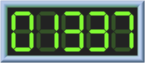

# React Retro Hit Counter

[]() [](2700) []()

Remember when the web was this quirky place full of "Under Construction" clipart, guestbooks, web rings, and animated GIF backgrounds?

Relive your youth with this straight-outta-geocities hit counter. If you have a page on the Information SuperHighway, slap this counter on it and impress all your friends.



> This is easily the best React counter you'll find anywhere on Altavista.

---

### Is this serious?

Yes! It's a real thing. I'll be maintaining it.

### Does this actually track hits?

No. This is just a presentational component; bring-your-own-tracking-system. If you need one, I recommend [micro-analytics](https://github.com/micro-analytics/micro-analytics-cli).

### Compatibility

Compatible with React 15.3 or higher.

As for browser compatibility, I believe this should be compatible all major browsers. I haven't tested on IE or Edge, but see no reason it wouldn't work.

(If anyone with a Windows machine can test this out, please let me know!)

### Installation

```bash
$ yarn install react-retro-hit-counter
# or
$ npm i -s react-retro-hit-counter
```

### Usage

```jsx
import RetroHitCounter from 'react-retro-hit-counter';

const YourComponent = () => (
  <RetroHitCounter
    withBorder
    withGlow
    hits={1337}
    /* The following are all default values: */
    minLength={4}
    size={40}
    padding={4}
    digitSpacing={3}
    segmentThickness={4}
    segmentSpacing={0.5}
    segmentActiveColor="#76FF03"
    segmentInactiveColor="#315324"
    backgroundColor="#222222"
    borderThickness={6}
    glowStrength={0.5}
  />
);
```

### API Reference

##### `hits`

| **Type:** | **Default Value** |
| --------- | ----------------- |
| `number`  | `undefined`       |

The number of hits to display!

> Protip: You can cheat, I won't tell! `hits={actualNumber * 100}`

##### `minLength`

| **Type:** | **Default Value** |
| --------- | ----------------- |
| `number`  | `4`               |

Single-digit hit counters are sad. Start-pad the number with this many 0s. `8` -> `0008`.


##### `size`

| **Type:** | **Default Value** |
| --------- | ----------------- |
| `number`  | `40`              |

The height in pixels of each digit.


##### `padding`

| **Type:** | **Default Value** |
| --------- | ----------------- |
| `number`  | `4`               |

The padding, in pixels, around the hit counter.


##### `digitSpacing`

| **Type:** | **Default Value** |
| --------- | ----------------- |
| `number`  | `3`               |

The amount of space, in pixels, between each digit.


##### `segmentThickness`

| **Type:** | **Default Value** |
| --------- | ----------------- |
| `number`  | `4`               |

The width of each segment, in pixels.

You can make really abstract numbers with this prop! I've decided that this is a feature, not a bug.


##### `segmentSpacing`

| **Type:** | **Default Value** |
| --------- | ----------------- |
| `number`  | `0.5`             |

Spacing between the segments, in pixels.


##### `segmentActiveColor`

| **Type:** | **Default Value** |
| --------- | ----------------- |
| `string`  | `#76FF03`         |

Each digit is comprised of 7 segments, and this prop controls the color of the active ones (AKA the number itself).


##### `segmentInactiveColor`

| **Type:** | **Default Value** |
| --------- | ----------------- |
| `string`  | `#315324`         |

Controls the color of the inactive segments. Pass "transparent" for no inactive segments.


##### `backgroundColor`

| **Type:** | **Default Value** |
| --------- | ----------------- |
| `string`  | `#222222`         |

Set a custom background color for your hit counter. Accepts any valid CSS value (pass "transparent" for no background).


##### `withBorder`

| **Type:** | **Default Value** |
| --------- | ----------------- |
| `boolean` | `true`            |

No 90s hit counter would be complete without a skeumorphic chrome border!


> Protip: You can use the border on your own if you like, it's a named export. `import {RetroBorder} from 'react-retro-hit-counter'`. You'll need to provide an explicit width/height, though (the border is made in Canvas, and I didn't want the cost of reading width/height from the DOM).
>
> You can find its props [here](https://github.com/joshwcomeau/react-retro-hit-counter/blob/master/src/components/RetroBorder/RetroBorder.js#L12)

##### `borderThickness`

| **Type:** | **Default Value** |
| --------- | ----------------- |
| `number`  | `7`               |

Width, in pixels, of the border. Only used if `withBorder` is set to `true`.


##### `withGlow`

| **Type:** | **Default Value** |
| --------- | ----------------- |
| `boolean` | `false`           |

If desired, a soft glow can be emitted from the hit counter. This works especially well with the border.

The color of the glow is based on `segmentActiveColor`.


##### `glowSize`

| **Type:** | **Default Value** |
| --------- | ----------------- |
| `number`  | `2`               |

This parameter controls both the negative margin of the glow, as well as the blur amount. Larger values take up more space, but are also more of a soft blur.


##### `glowStrength`

| **Type:** | **Default Value** |
| --------- | ----------------- |
| `number`  | `0.4`             |

The opacity of the glow. Only used if `withGlow` is set to `true`.


### Future Work and Contributions

Wanna help bring that 90s aesthetic back to the web?

There are a few things I'd like to do, and could use a hand with:

* a11y: unclear if the best approach is to use aria tags, or just add actual zero-opacity text like "Hit counter. Number: n" that screen-readers can recite.
* The segments are all the same shape. This can be harmful to legibility; ideally, you want the outer pieces to be trapezoids. [See an example](https://www.jqueryscript.net/images/Stylish-jQuery-CSS3-Based-Digital-Clock.jpg).
* Tests! I have very few tests, none on the component itself. This should change.

###
